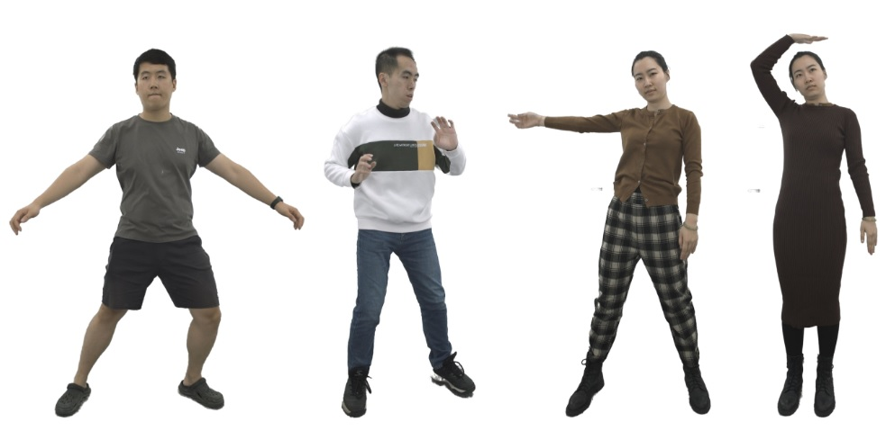
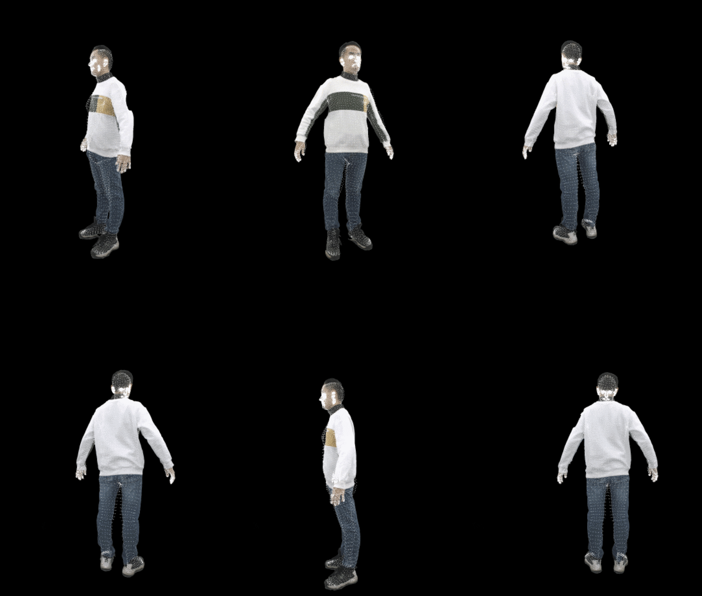

# AvatarReX Dataset

### AvatarReX: Real-time Expressive Full-body Avatars
Zerong Zheng, Xiaochen Zhao, Hongwen Zhang, Boning Liu, Yebin Liu.  SIGGRAPH 2023

[[Project Page]](https://liuyebin.com/AvatarRex/)



This dataset contains four multi-view image sequences used in our paper "AvatarReX: Real-time Expressive Full-body Avatars". They are captured with 16 well-calibrated RGB cameras in 30 fps, with a resolution of 1500×2048 and lengths ranging from 1800 to 2000 frames. We use the data to evaluate our method for building animatable human body avatars. 

We also provide the SMPL-X fitting in the dataset. 


## Agreement
1. The AvatarReX dataset (the "Dataset") is available for **non-commercial** research purposes only. Any other use, in particular any use for commercial purposes, is prohibited. This includes, without limitation, incorporation in a commercial product, use in a commercial service, as training data for a commercial product, for commercial ergonomic analysis (e.g. product design, architectural design, etc.), or production of other artifacts for commercial purposes including, for example, web services, movies, television programs, mobile applications, or video games. The dataset may not be used for pornographic purposes or to generate pornographic material whether commercial or not. The Dataset may not be reproduced, modified and/or made available in any form to any third party without Tsinghua University’s prior written permission.

2. You agree **not to** reproduce, modified, duplicate, copy, sell, trade, resell or exploit any portion of the images and any portion of derived data in any form to any third party without Tsinghua University’s prior written permission.

3. You agree **not to** further copy, publish or distribute any portion of the Dataset. Except, for internal use at a single site within the same organization it is allowed to make copies of the dataset.

4. Tsinghua University reserves the right to terminate your access to the Dataset at any time.


## Download Instructions 
The dataset can be directly downloaded from the following links.

* avatarrex_zzr: [this link](https://drive.google.com/file/d/1sCQJ3YU-F3lY9p_HYNIQbT7QyfVKy0HT/view?usp=sharing), 2001 frames in total, ~21 GB
* avatarrex_zxc: [this link](https://drive.google.com/file/d/1pY1qRj2n6b2YOCmZRVM1D--CXKR02qXU/view?usp=sharing), 1801 frames in total, ~12 GB
* avatarrex_lbn1: [this link](https://drive.google.com/file/d/1DuESdA5YwvJKapyo7i_KoQxKHHFWzi-w/view?usp=sharing), 1901 frames in total, ~11 GB
* avatarrex_lbn2: [this link](https://drive.google.com/file/d/1J7ITsYhuWlqhoIkmYni8dL2KJw-wmcy_/view?usp=sharing), 1871 frames in total, ~16 GB

Note again that by downloading the dataset you acknowledge that you have read the agreement, understand it, and agree to be bound by them. If you do not agree with these terms and conditions, you must not download and/or use the Dataset.


## Data Explanation
For each subject, we provide the multi-view images (```./avatarrex_zzr/********/```) as well as the foreground segmentation (```./avatarrex_zzr/********/mask/pha```), which are obtained using [BackgroundMattingV2](https://github.com/PeterL1n/BackgroundMattingV2). The calibration data is provided in ```calibration_full.json```, and the SMPL fitting in ```smpl_params.npz```. Some frames are losed during the capture process, and we provide their filename in ```missing_img_files.txt```. 

Here we provide a code snip to show how to parse and visualize the data:
```python
import os
import json
import numpy as np
import cv2 as cv
import torch
import smplx  # (please setup the official SMPL-X model according to: https://pypi.org/project/smplx/)

subject = './avatarrex_zzr'
# subject = './avatarrex_zxc'
# subject = './avatarrex_lbn1'
# subject = './avatarrex_lbn2'

# initialize smpl model
smpl = smplx.SMPLX(model_path = './smplx', gender = 'neutral', use_pca = False, num_pca_comps = 45, flat_hand_mean = True, batch_size = 1)

# load camera data
with open(os.path.join(subject, 'calibration_full.json'), 'r') as fp:
    cam_data = json.load(fp)

# load smpl data
smpl_data = np.load(os.path.join(subject, 'smpl_params.npz'), allow_pickle = True)
smpl_data = dict(smpl_data)
smpl_data = {k: torch.from_numpy(v.astype(np.float32)) for k, v in smpl_data.items()}

frame_num = smpl_data['body_pose'].shape[0]
for frame_id in range(0, frame_num, 30):
    smpl_out = smpl.forward(
        global_orient = smpl_data['global_orient'][frame_id].unsqueeze(0),
        transl = smpl_data['transl'][frame_id].unsqueeze(0),
        body_pose = smpl_data['body_pose'][frame_id].unsqueeze(0),
        jaw_pose = smpl_data['jaw_pose'][frame_id].unsqueeze(0),
        betas = smpl_data['betas'][0].unsqueeze(0),
        expression = smpl_data['expression'][frame_id].unsqueeze(0),
        left_hand_pose = smpl_data['left_hand_pose'][frame_id].unsqueeze(0),
        right_hand_pose = smpl_data['right_hand_pose'][frame_id].unsqueeze(0),
    )
    smpl_verts = smpl_out.vertices  # smpl vertices in live poses
    smpl_verts = smpl_verts.detach().cpu().numpy().squeeze(0)

    smpl_proj_vis = []
    for cam_id in range(0, len(cam_data), 3):
        cam_sn = list(cam_data.keys())[cam_id]

        img_fpath = os.path.join(subject, '%s/%08d.jpg' % (cam_sn, frame_id))
        msk_fpath = os.path.join(subject, '%s/mask/pha/%08d.jpg' % (cam_sn, frame_id))

        if (not os.path.isfile(img_fpath)) or (not os.path.isfile(msk_fpath)):
            break

        img = cv.imread(img_fpath, cv.IMREAD_UNCHANGED)
        msk = cv.imread(msk_fpath, cv.IMREAD_GRAYSCALE)
        img = img * np.uint8(msk > 128)[:, :, np.newaxis]  # remove background
        img_ = cv.resize(img, (img.shape[1] // 2, img.shape[0] // 2))

        # transform smpl from world to camera
        cam_R = np.array(cam_data[cam_sn]['R']).astype(np.float32).reshape((3, 3))
        cam_t = np.array(cam_data[cam_sn]['T']).astype(np.float32).reshape((3,))
        smpl_verts_cam = np.matmul(smpl_verts, cam_R.transpose()) + cam_t.reshape(1, 3)

        # project smpl vertices to the image
        cam_K = np.array(cam_data[cam_sn]['K']).astype(np.float32).reshape((3, 3))
        cam_K *= np.array([img_.shape[1] / img.shape[1], img_.shape[0] / img.shape[0], 1.0], dtype = np.float32).reshape(3, 1)
        smpl_verts_proj = np.matmul(smpl_verts_cam / smpl_verts_cam[:, 2:], cam_K.transpose())

        # visualize the projection
        smpl_verts_proj = np.round(smpl_verts_proj).astype(np.int32)
        smpl_verts_proj[:, 0] = np.clip(smpl_verts_proj[:, 0], 0, img_.shape[1] - 1)
        smpl_verts_proj[:, 1] = np.clip(smpl_verts_proj[:, 1], 0, img_.shape[0] - 1)

        for v in smpl_verts_proj:
            img_[v[1], v[0], :] = np.array([255, 255, 255], dtype = np.uint8)
        smpl_proj_vis.append(img_)

    if len(smpl_proj_vis) != 6:
        continue

    vis = np.concatenate([
        np.concatenate(smpl_proj_vis[:3], axis = 1),
        np.concatenate(smpl_proj_vis[3:], axis = 1),
    ], axis = 0)
    vis = cv.resize(vis, (0, 0), fx = 0.5, fy = 0.5)
    cv.imshow('vis', vis)
    cv.waitKey(1)
```
If everything is setup properly, you can see an animation like this:
<p align="center"> 
    
</p>


## Related Datasets from THU3DV Lab [[Link]](https://liuyebin.com/dataset.html)
[[THuman4.0 Dataset]](https://github.com/ZhengZerong/THUman4.0-Dataset/) Containing 3 multi-view RGB sequences captured with 24 well-calibrated cameras as well as corresponding SMPL-X registration.

[[THuman3.0 Dataset]](https://github.com/fwbx529/THuman3.0-Dataset) Containing 20 human-garment combinations, where each combination has 15 to 35 high-quality human scans captured by a dense DLSR rig.  

[[MultiHuman Dataset]](https://github.com/y-zheng18/MultiHuman-Dataset/) Containing 453 high-quality scans, each contains 1-3 persons. The dataset can be used to train and evaluate multi-person reconstruction algorithms.

[[THuman2.0 Dataset]](https://github.com/ytrock/THuman2.0-Dataset) Containing 500 high-quality human scans captured by a dense DLSR rig, with SMPL annotations. 


## Citation
If you use this dataset for your research, please consider citing:
```bibtex
@article{zheng2023avatarrex,
  title={AvatarRex: Real-time Expressive Full-body Avatars},
  author={Zheng, Zerong and Zhao, Xiaochen and Zhang, Hongwen and Liu, Boning and Liu, Yebin},
  journal={ACM Transactions on Graphics (TOG)},
  volume={42},
  number={4},
  articleno={},
  year={2023},
  publisher={ACM New York, NY, USA}
}

@inproceedings{li2023animatablegaussians,
  title={Animatable Gaussians: Learning Pose-dependent Gaussian Maps for High-fidelity Human Avatar Modeling},
  author={Li, Zhe and Zheng, Zerong and Wang, Lizhen and Liu, Yebin},
  booktitle={Proceedings of the IEEE/CVF Conference on Computer Vision and Pattern Recognition (CVPR)},
  year={2024}
}
```

## Contact
- Zerong Zheng [(zrzheng1995@foxmail.com)](mailto:zrzheng1995@foxmail.com)
- Zhe Li [(lizhe_thu@126.com)](mailto:lizhe_thu@126.com)
- Yebin Liu [(liuyebin@mail.tsinghua.edu.cn)](mailto:liuyebin@mail.tsinghua.edu.cn)