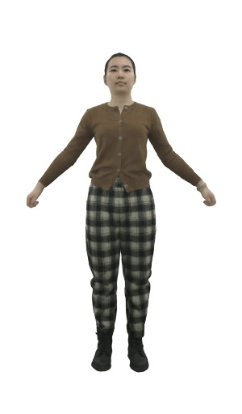

# Preprocessed Dataset

## AvatarReX Dataset

<table style="width:100%;border-spacing:0px;border-collapse:separate;margin-right:auto;margin-left:auto;font-size: large">
<tr>
<td style="padding:20px;width:20%;vertical-align:middle;border:none" align="center">
Figure
</td>
<td style="padding:20px;width:20%;vertical-align:middle;border:none" align="center">

</td>
<td style="padding:20px;width:20%;vertical-align:middle;border:none" align="center">

</td>
<td style="padding:20px;width:20%;vertical-align:middle;border:none" align="center">

</td>
</tr>
<tr>
<td style="padding:20px;width:20%;vertical-align:middle;border:none" align="center">
Character
</td>
<td style="padding:20px;width:20%;vertical-align:middle;border:none" align="center">
<a href="https://drive.google.com/file/d/1o5tIisBAhYxCl81SUZ4HGaEKyslCBD16/view?usp=sharing">avatarrex_zzr</a>
</td>
<td style="padding:20px;width:20%;vertical-align:middle;border:none" align="center">
<a href="https://drive.google.com/file/d/1RDM3v5P4XF6Sp88EusDvokw-yHg6Je0C/view?usp=sharing">avatarrex_lbn1</a>
</td>
<td style="padding:20px;width:20%;vertical-align:middle;border:none" align="center">
<a href="https://drive.google.com/file/d/1AuITI1KDHG4MbaNplnzmkcYDwii_Q419/view?usp=sharing">avatarrex_lbn2</a>
</td>
</tr>
</table>

## ActorsHQ Dataset

Templates are released [here](https://github.com/user-attachments/files/17004283/ActorsHQ_templates.zip).

<del>Stay tuned.</del> Cancelled due to graduation.

## THuman4.0 Dataset

<del>Stay tuned.</del> Cancelled due to graduation.
